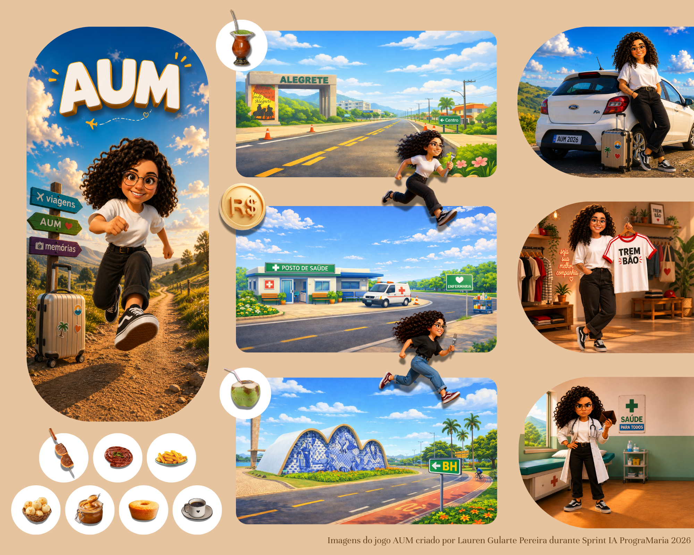
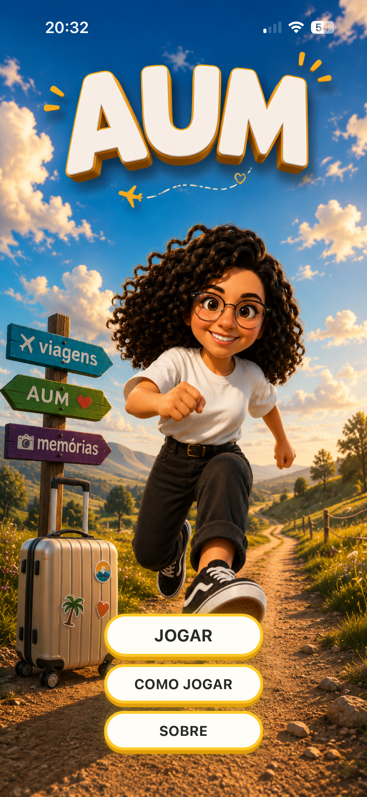

# 🎮 Jogo AUM

> Projeto acadêmico de jogo mobile desenvolvido durante a Sprint IA da PrograMaria.

  

## 🚀 Jogar agora

🌐 **https://jogo-aum.netlify.app/**

> 📱 O jogo pode ser acessado pelo computador, mas foi desenvolvido com foco em dispositivos móveis. Em iPhones, recomenda-se adicioná-lo à tela inicial para utilizá-lo em tela cheia, proporcionando uma experiência semelhante à de um aplicativo.

---

## 📖 Sobre o projeto

O Jogo AUM foi desenvolvido como projeto acadêmico durante a Sprint IA da PrograMaria.

O desafio proposto era criar um jogo para praticar habilidades de Vibe Coding. A ideia evoluiu e acabou se transformando em uma homenagem a uma amiga muito querida.

A personagem POPI adora viajar e experimentar comidas típicas em cada cidade que visita. Quando volta para casa, já está economizando e planejando o próximo destino. No jogo não poderia ser diferente!

---

## 👩‍💻 Minha participação

Durante o desenvolvimento fui responsável por:

- concepção da ideia do jogo;
- definição do fluxo de navegação;
- criação da identidade visual;
- criação das ilustrações com apoio de IA;
- gravação das falas da personagem POPI;
- testes e validação da experiência do usuário;
- refinamento contínuo do projeto até a publicação.

---

## 🛠 Processo de desenvolvimento

O projeto passou por diferentes etapas até sua publicação. Atualmente conta com três fases, mas foi estruturado para permitir a expansão com novas cidades e desafios.

A implementação começou no **Replit**, durante a Sprint IA da PrograMaria, com orientação da tutora do curso. Após atingir os limites da plataforma, continuei o desenvolvimento no **Cursor AI**, onde também encontrei limitações de uso.

Mesmo com uma versão funcional, decidi continuar aprimorando o projeto.

Utilizei **ChatGPT** e **Claude** como apoio para revisar trechos de código, solucionar problemas encontrados durante os testes e implementar melhorias que considerei importantes para a experiência do jogador.

As ilustrações foram criadas com o **Microsoft Copilot Image Creator**. Os efeitos sonoros foram obtidos em bibliotecas gratuitas e todas as falas da personagem **POPI** foram gravadas especialmente para este projeto.

A versão final foi publicada no **Netlify** e compartilhada com amigos para validação das funcionalidades. Além dos testes bem-sucedidos, o projeto proporcionou um momento muito especial: ver a emoção da própria Popi ao se reconhecer no jogo e dizer que nunca havia recebido uma homenagem tão bonita e personalizada!

---

## 🖼 Galeria

### Tela inicial

### Gameplay

### Personagem POPI

### Tela final

---

## 🧠 Principais aprendizados

Durante este projeto desenvolvi habilidades relacionadas a:

- resolução de problemas;
- adaptação entre diferentes ferramentas;
- desenvolvimento assistido por IA;
- experiência do usuário (UX);
- testes e refinamento de funcionalidades;
- organização de um projeto do início à publicação.

---

## 🛠 Tecnologias e ferramentas

- HTML
- CSS
- JavaScript
- Replit
- Cursor AI
- ChatGPT
- Claude
- Microsoft Copilot Image Creator
- DALL·E
- Netlify

---

Projeto desenvolvido por **Lauren Gularte Pereira**.
