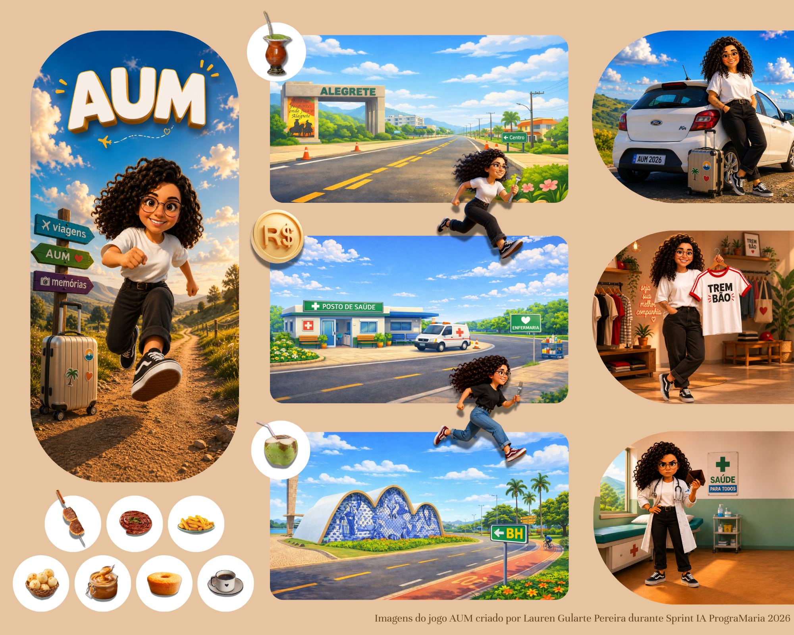
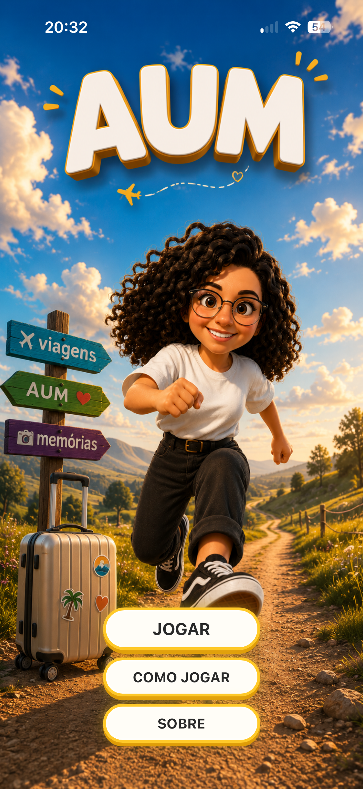

# 🎮 Jogo AUM

> Projeto acadêmico desenvolvido durante a Sprint IA da PrograMaria, utilizando HTML, CSS e JavaScript com apoio de ferramentas de Inteligência Artificial.

  

## 🚀 Jogar agora

🌐 **https://jogo-aum.netlify.app/**

> 📱 O jogo pode ser acessado pelo computador, mas foi desenvolvido com foco em dispositivos móveis. Em iPhones, recomenda-se adicioná-lo à tela inicial para uma experiência em tela cheia semelhante à de um aplicativo.

---

## 📖 Sobre o projeto

O Jogo AUM é um jogo interativo no qual a personagem POPI viaja por diferentes cidades e enfrenta desafios relacionados às suas aventuras.

A ideia surgiu durante a Sprint IA da PrograMaria e evoluiu para uma homenagem personalizada a uma amiga querida, incorporando sua personalidade, voz e elementos visuais criados especialmente para o projeto.

Atualmente, o jogo possui três fases e foi estruturado de forma a permitir a inclusão de novas cidades e desafios.

---

## 👩‍💻 Minha participação

Atuei em diferentes etapas do desenvolvimento e fui responsável por:

- criação da história e definição do fluxo de navegação;
- definição da identidade visual e dos elementos da experiência;
- criação das ilustrações com apoio de Inteligência Artificial;
- gravação das falas da personagem POPI;
- testes e validação das funcionalidades;
- identificação de problemas e refinamento da experiência;
- evolução do projeto até sua publicação.

---

## 🛠 Processo de desenvolvimento

O desenvolvimento começou no **Replit**, durante a Sprint IA da PrograMaria, com orientação da tutora do curso.

Após atingir limitações da plataforma, o desenvolvimento continuou no **Cursor**, mantendo a estrutura do projeto e realizando novas implementações e ajustes.

Durante o processo, utilizei **ChatGPT** e **Claude** como ferramentas de apoio para:

- revisar trechos de código;
- investigar e solucionar problemas;
- implementar melhorias;
- testar diferentes abordagens;
- refinar funcionalidades.

As ilustrações foram criadas com apoio do **Copilot**. Os efeitos sonoros foram obtidos em bibliotecas gratuitas, enquanto todas as falas da personagem **POPI** foram gravadas especialmente para o projeto.

Após os testes, a versão final foi publicada na **Netlify** e compartilhada para validação das funcionalidades e da experiência de uso.

---

## 🧠 Habilidades desenvolvidas

Durante o projeto, desenvolvi e pratiquei conhecimentos relacionados a:

- desenvolvimento web com HTML, CSS e JavaScript;
- experiência do usuário (UX);
- prototipação e evolução de interfaces;
- resolução de problemas;
- testes e validação de funcionalidades;
- desenvolvimento assistido por Inteligência Artificial;
- adaptação entre diferentes ferramentas de desenvolvimento;
- organização e evolução de um projeto até sua publicação.

---

## 🖼 Galeria

### Tela inicial

### Gameplay

### Personagem POPI

### Tela final

---

## 🛠 Tecnologias e ferramentas

- HTML
- CSS
- JavaScript
- Replit
- Cursor
- ChatGPT
- Claude
- Microsoft Copilot Image Creator
- Netlify

---

## 📌 Projeto

**Desenvolvido por Lauren Gularte Pereira**
